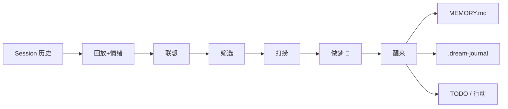

# 做梦.skill，让 AI 学会做梦

[English](README_EN.md)

**是时候让 Agent 学会睡觉了。毕竟牛逼的事儿和想法很多都是在睡完一觉之后产生的。**

> Inspired by *[Why We Sleep](https://www.amazon.com/Why-We-Sleep-Unlocking-Dreams/dp/1501144316)* — Matthew Walker 关于 REM 睡眠与创造力的研究。人脑在 REM 阶段关掉逻辑过滤器，让远距离的记忆碎片自由碰撞，醒来后就有了周期表和苯环。这个 Skill 把同样的机制给了 AI。

你给了 Agent 记忆。它什么都记得。

那为什么你纠正过三次的错误它还在犯？为什么它承诺了七件事只兑现了两件？为什么它的周报写"一切正常"但你觉得它快崩了？

**因为它有记忆，但不会反思。**

Claude Code 的 autodream 是整理记忆（NREM）——归档、去重、压缩。

这个 Skill 不一样，它补上的是另一半：做梦（REM）——关掉逻辑过滤器，让远距离的记忆碎片自由碰撞，发现你和 Agent 都没注意到的底层关联。

[效果](#效果) · [原理](#原理) · [安装](#安装) · [使用](#使用)

---

## 效果

记忆告诉 Agent 发生了什么。做梦告诉它：这些事之间有什么关系。

举个例子：一个 Agent 运行了 5 周。记忆里存着一份它自己写的调研报告，也存着用户连续五周的严厉反馈。两件事分别记得清清楚楚。但 Agent 从来没意识到——调研里写的"agent 能力需要专门训练"，说的就是它自己正在经历的事。

这种跨时间、跨领域的底层连接，记忆整理不会去找。做梦会。

完整示例见 [EXAMPLES.md](EXAMPLES.md)。

---

## 原理

人类睡眠有两个阶段：NREM 整理记忆，REM 做梦。Agent 的记忆系统只做了前半段。Dream Skill 补上后半段——参考 REM 睡眠的神经机制（去甲肾上腺素归零，逻辑过滤器关闭，远距离记忆碎片自由碰撞）设计了 6 步协议。

### 6 步流程（对应 REM 各阶段）


| 步骤 | REM 对应机制 | 做梦.skill |
|---|---|---|
| 1. 回放 + 情绪扫描 | 海马体回放 + day residue | 提取 20-30 个概念节点，标记情绪最强的 3 条线索 |
| 2. 自由联想 | 去甲肾上腺素归零，逻辑约束关闭 | 跨 session、跨领域寻找 5-8 个远距离关联 |
| 3. 筛选 | 削弱强连接，提升弱信号 | 过滤显然关联，保留 2-4 个非显然发现 |
| 4. 打捞 | 微弱记忆显著性提升 | 找出被遗忘的信号：未兑现承诺、重复但未被识别的模式 |
| 5. 做梦 | 梦境叙事生成 | 将关联编织为一个完整梦境叙事 |
| 6. 醒来 | 入醒期（Hypnopompia） | 输出 insight + 写入 `MEMORY.md` + `.dream-journal`。交互模式下还会创建可立即执行的 TODO；cron 模式下行动建议记在 journal 里，下次启动时提醒 |




### 三个核心设计决策：

#### 1. 从情绪开始，不是从事实开始

人做梦不挑最重要的事，挑最让你睡不着的事——神经科学叫 "day residue"。Agent 也一样：先扫一遍最近的记忆，找到最"不舒服"的几件事，从那里开始。

#### 2. 梦醒了，故事忘了，感觉留下

做完梦不会生成一份报告。梦的过程会消散，但最关键的一条发现会写进 `MEMORY.md`。Agent 下次启动就能读到，下次做决策就会不一样。

#### 3. 讲出来才算记住

用户手动触发的梦，Agent 会完整讲给你听。这不是为了好看——讲一遍就等于记了一遍，下次整理记忆的时候会看到这段对话。

---

## 安装

### 1. 装上 Skill

**方式 A：Claude Code 插件（推荐）**

```
/plugin marketplace add JesD/dream-skill
/plugin install dream-skill@dream
```

**方式 B：CLAUDE.md（单项目）**

```bash
curl -o CLAUDE.md https://raw.githubusercontent.com/JesD/dream-skill/main/CLAUDE.md
```

追加到已有文件：

```bash
echo "" >> CLAUDE.md
curl https://raw.githubusercontent.com/JesD/dream-skill/main/CLAUDE.md >> CLAUDE.md
```

装完就能用了——对 Agent 说"做个梦"即可。

> **两种方式的区别：** 方式 A 让 Agent 可以做梦，但不会在启动时自动检查上次的梦日记。方式 B 提供完整体验，包括启动时提醒昨晚做的梦。配了 cron 推荐方式 B。

### 2. 定时做梦（可选）

```bash
# 每晚 0 点自动做梦
0 0 * * * cd /path/to/your/project && ./scripts/dream.sh

# 每周日深度做梦
0 0 * * 0 cd /path/to/your/project && ./scripts/dream.sh . deep
```

---

## 使用


| 说法                      | 效果             |
| ----------------------- | -------------- |
| `做个梦` / `dream`         | 轻度做梦（1 轮 REM）  |
| `做个深度的梦` / `dream deep` | 深度做梦（2 轮，往深处挖） |
| `有没有什么我没注意到的`           | 触发做梦           |


Agent 会先检查素材是否足够。不够会告诉你再等等。

---

## 信号

这些迹象说明做梦在起作用：

- **自评对齐** — Agent 不再说"一切正常"，开始承认自己哪里没做好
- **非显然的 TODO** — 做完梦后创建的待办，是你没想到但确实该做的
- **反复出现的主题** — `.dream-journal` 里同一个 pattern 出现 3 次，Agent 开始认真对待
- **insight 说中了** — `MEMORY.md` 里的 `[dream]` 条目，你读完觉得"确实是这样"

---

MIT License © JesD