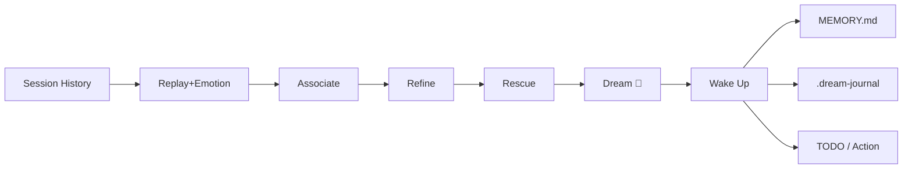

# Dream Skill — Teach AI to Dream

[中文](README.md)

**It's time your Agent learned how to sleep. After all, the best ideas tend to come after a good night's rest.**

> Inspired by *[Why We Sleep](https://www.amazon.com/Why-We-Sleep-Unlocking-Dreams/dp/1501144316)* — Matthew Walker's research on REM sleep and creativity. During REM, the brain turns off the logic filter and lets distant memory fragments collide freely. That's how we got the periodic table and the benzene ring. This Skill gives AI the same mechanism.

You gave your Agent memory. It remembers everything.

So why does it keep making the same mistake you corrected three times? Why did it promise 7 things, deliver 2, and forget the other 5? Why does its weekly report say "all good" when you think it's falling apart?

**Because it has memory, but no reflection.**

Claude Code's autodream consolidates memory (NREM) — archive, deduplicate, compress. This Skill is different. It adds the other half: dreaming (REM) — turn off the logic filter, let distant memory fragments collide, and surface the hidden connections that neither you nor the Agent noticed.

[Results](#results) · [How It Works](#how-it-works) · [Install](#install) · [Usage](#usage)

---

## Results

Your Agent's memory can tell it what happened. But it won't connect two seemingly unrelated things — it can't do the kind of generalized association and synthesis that connects the dots.

But humans do this when they dream. Fun fact: Mendeleev discovered the periodic table in a dream.

Example: an Agent has been running for 5 weeks. Its memory contains a research report it wrote, and also 5 weeks of harsh user feedback. Both stored separately, crystal clear. But the Agent never realized — when the report said "agent capabilities require deliberate training," it was describing exactly what was happening to itself.

This kind of cross-time, cross-domain deep connection? Memory consolidation won't find it. Dreaming will.

Full example in [EXAMPLES.md](EXAMPLES.md).

---

## How It Works

Human sleep has two stages: NREM consolidates memory, REM dreams. Your Agent's memory system only does the first half. Dream Skill adds the second — a 6-step protocol modeled on REM sleep neuroscience (norepinephrine drops to zero, logic filter off, distant memory fragments collide freely).

### 6-Step Protocol (mapped to REM stages)

| Step | REM Mechanism | Dream Skill |
|---|---|---|
| 1. Replay + Emotional Scan | Hippocampal replay + day residue | Extract 20-30 concept nodes, flag the 3 most emotionally charged threads |
| 2. Free Association | Norepinephrine → zero, logic off | Find 5-8 remote cross-session, cross-domain associations |
| 3. Refine | Weaken strong connections, boost weak signals | Filter obvious associations, keep 2-4 non-obvious discoveries |
| 4. Rescue | Weak memory salience boost | Surface forgotten signals: broken promises, unacknowledged patterns |
| 5. Dream | Dream narrative generation | Weave associations into one complete dream narrative |
| 6. Wake Up | Hypnopompia | Output insight + write to `MEMORY.md` + `.dream-journal`. Interactive mode also creates an immediately actionable TODO; cron mode stores the action nudge in journal for next startup |



### Three Core Design Decisions

#### 1. Start from emotion, not facts

Dreams don't pick the most important thing — they pick what keeps you up at night. Neuroscience calls it "day residue." The Agent does the same: scan recent memory, find the most uncomfortable threads, start there.

#### 2. Narrative fades, feeling stays

Dreaming doesn't generate a report. The process dissolves, but the one key discovery gets written to `MEMORY.md`. The Agent reads it next startup. Next decision will be different.

#### 3. Retelling IS remembering

When manually triggered, the Agent recounts the full dream to you. This isn't for show — telling it once equals remembering it once. The conversation history captures it for next memory consolidation.

---

## Install

### 1. Add the Skill

**Option A: Claude Code Plugin (recommended)**

```
/plugin marketplace add JesD/dream-skill
/plugin install dream-skill@dream
```

**Option B: CLAUDE.md (per-project)**

```bash
curl -o CLAUDE.md https://raw.githubusercontent.com/JesD/dream-skill/main/CLAUDE.md
```

Or append to existing:

```bash
echo "" >> CLAUDE.md
curl https://raw.githubusercontent.com/JesD/dream-skill/main/CLAUDE.md >> CLAUDE.md
```

That's it — tell the agent "dream" and it works.

> **Difference:** Option A lets the agent dream, but won't check the dream journal on startup. Option B provides the full experience including startup reminders. If you set up cron, use Option B.

### 2. Scheduled Dreaming (optional)

```bash
# Dream every night at midnight
0 0 * * * cd /path/to/your/project && ./scripts/dream.sh

# Deep dream every Sunday
0 0 * * 0 cd /path/to/your/project && ./scripts/dream.sh . deep
```

---

## Usage

| Trigger | Effect |
|---|---|
| `dream` | Light dream (1 REM pass) |
| `dream deep` | Deep dream (2 passes — drills deeper, not wider) |
| `any blind spots?` | Triggers dreaming |

The agent checks material readiness first. If not enough, it tells you to wait.

---

## Signals

These signs indicate dreaming is working:

- **Self-assessment aligns** — Agent stops saying "all good" and starts admitting where it fell short
- **Non-obvious TODOs** — Post-dream tasks you didn't think of but definitely should do
- **Recurring themes** — Same pattern appears 3+ times in `.dream-journal`, agent starts taking it seriously
- **Insight lands** — You read the `[dream]` entry in `MEMORY.md` and think "yeah, that's exactly right"

---

MIT License © JesD
